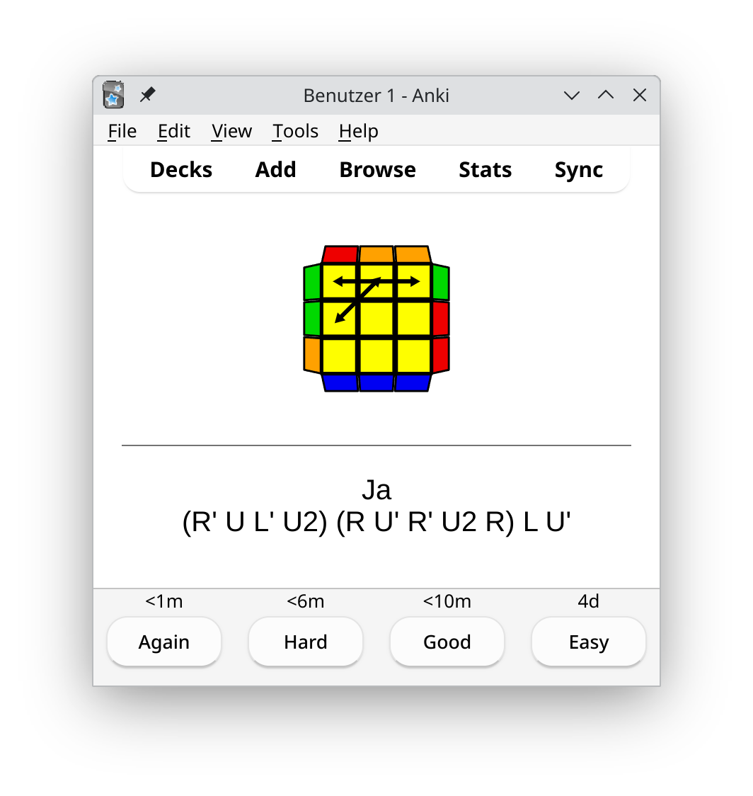

# Lernkarten for Rubik's Cube - Fridrich Method


This project provides Lernkarten (German for learning cards) for memorizing the algorithms
needed to solve a Rubik's Cube using the Fridrich Method (CFOP). Two kinds of
cards are provided:

* Anki flashcards for spaced repetition learning
* physical printable cards for offline study

The icons will be generated from provided algorithms, so that the icons are
guaranteed to match the algorithms exactly.

All SVGs, CSVs and PDFs are easily regenerable using the provided scripts.
However, they are added here so that users can directly use them without
getting into technical details.

## Structure of the Repository

The repository is structured into folders for each type of algorithm.

| Algorithm Set | Example | Description |
|---------------|---------|-------------|
| **2-look-oll** |  | Lernkarten for the eight 2-Look OLL algorithms (omitting edge orientation) |
| **oll** |  | Lernkarten for the 57 OLL (Orientation of the Last Layer) algorithms |
| **pll** |  | Lernkarten for the 21 PLL (Permutation of the Last Layer) algorithms including rotation arrows.<br><br>**Note:** The icons show the cube you get by applying the algorithm repeatedly with the blue face in front.|
| **big-cube** |  | Lernkarten for some big cube algorithms (4x4 and larger) |

Additionally, there is the `lernkarten_scripts` folder containing a Python
program for regeneration of the icons, CSVs and PDFs.

## Using the Lernkarten

### Anki Flashcards



Each flashcard folder contains icons and a file `ankiCardSet.csv`. In order to import them
into Anki, follow these steps:

* copy the SVG files into Anki's media collection folder (see
  [here](https://superuser.com/q/963526/913769) for how to find it)
* import the `ankiCardSet.csv` file using Anki's import function

Now you should see the cards in your Anki collection.

### Physical Printable Cards

The printable cards are provided as PDF files. They are designed to be printed
two-sided ([short edge
tumble](https://superuser.com/questions/221343/lpr-printing-tumble-mode)). Then
the algorithms will be on the back of the corresponding icons.

The PDFs are designed to be cuttable in batches, allowing for more convenient
preparation.

## How to Regenerate the Lernkarten

Everything required to regenerate the Lernkarten is provided by the Python
program in `lernkarten_scripts/`. In order to run it, one needs to have
[`uv`](https://docs.astral.sh/uv/) and Python 3 installed. One ad-hoc way to
install `uv` is to run

```bash
pipx install uv
```

, but make sure to check the [official installation
instructions](https://docs.astral.sh/uv/getting-started/installation/) and your
platform's best practices. For instance, on [Arch
Linux](https://archlinux.org/), `uv` can be installed via `pacman`.

After that, the script can be executed by running

```bash
uv run generate-algorithm-cards --help
```

, which will show the available options.

### How to regenerate Anki flashcards

In order to regenerate the Anki flashcards for algorithm set OLL, run the
following command from the project's root folder:

```bash
uv run generate-algorithm-cards --algorithm-set oll oll-output-dir
```

This will regenerate

* the SVG icons using
  [visualcube.api.cubing.net](https://visualcube.api.cubing.net)
* the `ankiCardSet.csv` file for Anki import
* a `Makefile` and `Lernkarten.tex` file for generating printable cards

Regarding Anki, this is all that is needed.

### How to regenerate physical printable cards

In order to regenerate the printable cards, the $\LaTeX$ file needs to be
compiled to a PDF file. Ideally, this can be done using the Makefile:

```bash
# Regenerate printable Lernkarten for OLL. Replace "oll" with any other
# algorithm set folder name as needed.
make -C oll-output-dir
```

Unfortunately, the Makefile is not portable across different systems. If it
cannot be used, the following steps need to be done manually:

* All SVG files need to be converted to PDF files with the same name. For
  instance, the file `pll/Ja.svg` needs to be converted to `pll/Ja.pdf`.
* The `Lernkarten.tex` file needs to be compiled using `lualatex`. The
  time-honoured `pdflatex` will not work.


### How to change algorithms

In order to change the algorithms used for generating the Lernkarten, the
file `lernkarten_scripts/algorithms.py` needs to be edited. There, the
algorithms are defined in Python lists. Since the icons are generated from the
algorithms, changing the algorithms and regenerating the Lernkarten will
automatically update the icons as well. This works very well for OLL and
2-Look OLL.

**Attention:** The arrows and setup rotations for PLL algorithms are not
generated automatically. They need to be adjusted manually too. They are
defined right next to the algorithm.


## A Note on Deck Usage

When using the Lernkarten in Anki, it is recommended to set up a big deck
containing all the cards. This allows for better spaced repetition learning
across all algorithm sets. This is in line with [the recommendations of Anki
itself](https://docs.ankiweb.net/editing.html#using-decks-appropriately).

The author started with four decks (OLL, PLL, F2L and Big Cubes) only to be
overburdened by tracking progress on multiple decks. Switching to a single deck
hands over the bookkeeping to Anki. In particular, limits for new cards are
consolidated across all algorithm sets. Without that, after learning some new
cards for one deck Anki would have you learn new cards for another deck, which
is counterproductive and overburdening.

Instead of multi-deck usage, the tags can be used to create filtered decks for
focused study sessions on a particular algorithm set. With that, one can still
learn some cards first, e.g. 2-Look OLL or PLL, before moving on to the full
set.


## Acknowledgements

I want to thank Andy Klise of https://www.kungfoomanchu.com/ for providing
excellent guides. Without these I wouldn't have started learning the
Fridrich Method in the first place.

Another great source of algorithms was Feliks Zemdegs project
https://www.cubeskills.com/. The provided algorithms there allowed me to fine
tune the algorithms used in this project.

While there are some cube visualization tools available online, none of them
match the brilliance of
[visualcube.api.cubing.net](https://visualcube.api.cubing.net). It is
feature-rich, scriptable and produces impressive icons.

Last but not least I want to thank the anonymous contributor of Anki cubing
flashcards found [here](https://ankiweb.net/shared/by-author/916788332).
They were a great starting point for creating my own Anki cards.
